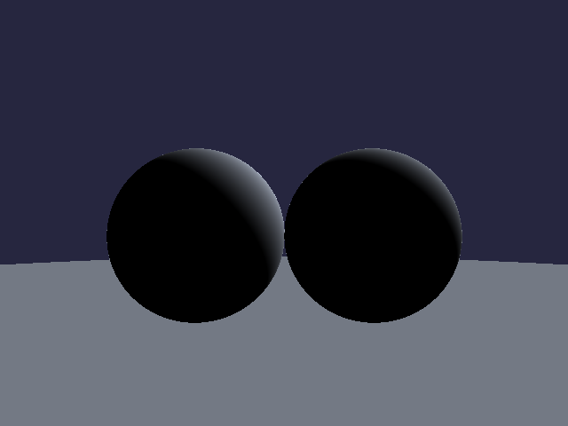

# Python Ray Marching Renderer



Real-time ray marching renderer written in pure Python with NumPy vectorization.

This project was created as an exploration of real-time rendering techniques, procedural geometry and numerical optimization in Python.

## Features

- Real-time SDF rendering
- Soft lighting and shadows
- Sphere tracing algorithm
- PNG export
- Pure Python implementation
- NumPy accelerated calculations

## Result


## Performance

Measured on CPU (NumPy vectorized, 100 march steps):

| Resolution | Render Time | FPS  |
|------------|-------------|------|
| 320×240    | 1.2s        | 0.8  |
| 640×480    | 4.8s        | 0.2  |
| 1280×720   | 15.0s       | 0.07 |
| 1920×1080  | 35.4s       | 0.03 |

## Why?

Most ray marching examples are implemented in GLSL shaders on the GPU.

This project explores how far the same techniques can be pushed using pure Python and NumPy vectorization — no OpenGL, no shaders, no GPU.

The goal was to understand the rendering pipeline from first principles: ray generation, sphere tracing, SDF evaluation, and lighting — and to see how close a CPU renderer can get to real-time with proper vectorization.

## Architecture

```
Camera
  ↓
Ray Generation (numpy meshgrid)
  ↓
Sphere Tracing (iterative SDF stepping)
  ↓
SDF Evaluation (per-object distance fields)
  ↓
Lambert Diffuse Lighting
  ↓
Frame Buffer (numpy RGB array)
  ↓
PNG Export / Pygame Display
```

## Technical Details

- **Signed Distance Fields** — each primitive defines a function returning the closest distance to its surface
- **Sphere Tracing** — iterative algorithm that marches rays by the SDF step size, guaranteed not to overshoot
- **Lambert Diffuse Lighting** — per-pixel shading via dot product of surface normal and light direction
- **NumPy vectorization** — all pixels processed simultaneously as array operations, no Python per-pixel loops
- **Procedural scene generation** — scenes defined by stacking SDF primitives (spheres, planes)

## Current Limitations

- CPU renderer only
- No reflections
- No global illumination
- Single bounce lighting
- Optimized for educational purposes

## Future Work

- Reflections
- Ambient Occlusion
- BVH acceleration
- Material system
- Animation support

## Getting Started

```bash
git clone https://github.com/lavrenicus/pythonRayMarching.git
cd pythonRayMarching
python -m venv venv
source venv/bin/activate  # Linux/macOS
# venv\Scripts\activate   # Windows
pip install -r requirements.txt
```

## Usage

```bash
python main.py
```

Renders the default scene (two spheres on a plane), displays in a pygame window, and saves the output as PNG.

Press **Escape** or close the window to exit.

## Examples

### Basic Scene

```python
import objects
import utils
from main import render, display_with_pygame

sphere = objects.Sphere(position=(0, 0, 5), radius=2)
camera = objects.Camera(position=(0, 0, 0))
light = objects.Transform(position=(1, 1, -1))

rgb = render([sphere], camera, light, width=640, height=480)
display_with_pygame(rgb)
```

### Multiple Spheres

```python
scene = [
    objects.Sphere(position=(-2, 0, 5), radius=2),
    objects.Sphere(position=(2, 0, 5), radius=2),
    objects.Sphere(position=(0, 2, 5), radius=1),
]
camera = objects.Camera(position=(0, 0, 0))
light = objects.Transform(position=(1, 1, -1))

rgb = render(scene, camera, light)
```

### Custom Camera and Light

```python
camera = objects.Camera(position=(5, 3, -2))
light = objects.Transform(position=(-1, 2, 1))

rgb = render(scene, camera, light)
```

## Project Structure

```
pythonRayMarching/
├── main.py              # Entry point, scene setup, rendering pipeline
├── objects/
│   └── __init__.py      # Vector math, Sphere, Plane, Camera classes
├── utils/
│   └── __init__.py      # Vectorized ray marching engine
├── requirements.txt     # Python dependencies
├── screenshot.png       # Rendered output
└── .gitignore           # Git ignore rules
```

## License

MIT
